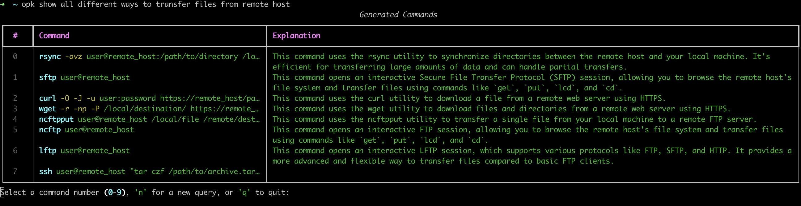

# Option-K: AI-Powered Instant CLI

Option-K is an AI-powered CLI assistant that helps you generate and execute shell and git commands based on natural language queries.

## Multiple Command View



## Instant Command with `Option + K` key combo


## Features

- Generate shell and git commands from natural language queries
- Execute generated commands directly from the CLI
- Quick suggestion mode for instant command generation
- Supports both macOS and Linux environments
- Configurable AI backend (Google AI Studio or Vertex AI)

## Installation

### Using Homebrew (macOS)

You can install Option-K using Homebrew:

```bash
brew tap zerocorebeta/core
brew install optionk
```

This will install both the Option-K CLI `opk` and server `opk-server`application.
After installation follow the instructions on the screen to complete setup.

## Usage

1. Type your query in terminal followed by `Option+K` hotkey combo. (configurable via alias)

2. The AI will generate a command based on your query. You can then edit or execute the command.

3. For more options, use the CLI directly:
   ```
   opk "your query here"
   ```

## Configuration

1. Request a free Google AI Studio API key [here](https://ai.google.dev/gemini-api/docs/getting-started)

2. Edit the `~/.config/optionk/config.ini` file to configure the AI backend:

```ini
[optionk]
port = 8089

[vertexai]
enabled = false
project = my-project
location = asia-south1
model = gemini-1.5-flash-001

[google_ai_studio]
enabled = true
api_key = YOUR_API_KEY_HERE
model = gemini-1.5-flash
```

Note `enabled` should be set to `true` for one of the AI backends.

Request a free Google AI Studio API key https://ai.google.dev/gemini-api

For vertex, auth is handled by gcloud cli:
https://cloud.google.com/vertex-ai/generative-ai/docs/start/quickstarts/quickstart-multimodal#set-up-your-environment

Note on Region Support:
- Vertex AI: Supports custom regions, allowing you to specify a location of your choice.
- Google AI Studio: Only supports the `us-central1` regi on. This cannot be changed.

When configuring your `config.ini`, keep in mind this difference in regional flexibility between the two services.

After editing the config file, restart the server  `brew services restart optionk`

Check logs here: `/usr/local/var/log/opk-server.log`

Test by running `opk "show current time"`

If you want one line quick suggestion: `opk "show current time" --quick` 

Now, all that is left is to map a hotkey combo to this `opk --quick command.`

Edit `~/.zshrc` if using zsg or ~/.bashrc if using bash as you shell and add this line:

```zsh

optionk() {
    local query="$BUFFER"
    local result=$(opk query --quick "$query")
    BUFFER="$result"
    zle end-of-line
}
zle -N optionk
bindkey '˚' optionk 
```

In this we are binding `option+k` to our custom function `optionk` which will generate the command based on the text we type in terminal.

You can edit `bindkey '˚' optionk` to map it to any other key combo. 
For more details read [here:](./BINDKEY.md)

Reload: `source ~/.zshrc` or `source ~/.bashrc`

Type in terminal `show date` followed by hotkey combo `Option+K` and you'll see the command there!

## Installation via Source

1. Clone the repository:
   ```
   git clone https://github.com/zerocorebeta/Option-K.git
   cd Option-K
   ```

2. Create a virtual environment and install dependencies:
   ```
   python -m venv venv
   source venv/bin/activate
   pip install -r requirements.txt
   ```

3. Configure the AI backend:
   - Create `~/.config/optionk/config.ini` file (create directory if it doesn't exist)
   - Edit the `~/.config/optionk/config.ini` file to set up your preferred AI service (Google AI Studio or Vertex AI)

4. Run the server:
   ```
   python server/opk-server.py
   ```

5. Test command completion using the detailed mode:
   ```
   python client/opk.py "your query here"
   ```
   or quick mode:
   ```
   python client/opk.py "your query here" --quick
   ```

6. Setup `server/opk-server.py` as a service

7. Add the alias to your shell configuration:
   
   Now, all that is left is to map a hotkey combo to this `opk --quick command.`

   Edit ~/.zshrc or ~/.bashrc and add this line (if `opk` is in path, if not then specify the full path):

   ```zsh
   optionk() {
      local query="$BUFFER"
      local result=$(opk query --quick "$query")
      BUFFER="$result"
      zle end-of-line
   }
   zle -N optionk
   bindkey '˚' optionk 
   ```
Reload: `source ~/.zshrc` or `source ~/.bashrc`

## Files

- `client/opk.py`: Main CLI interface
- `server/opk-server.py`: Backend server handling AI requests

## Contributing

Contributions are welcome! Please feel free to submit a Pull Request.

## License

[MIT License](LICENSE)